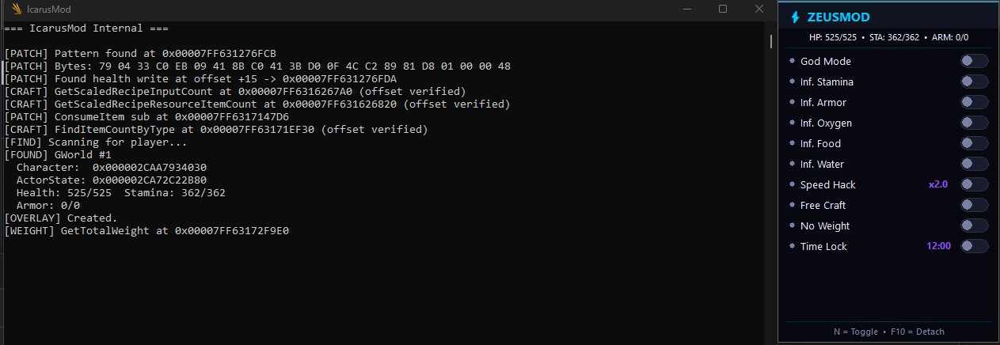
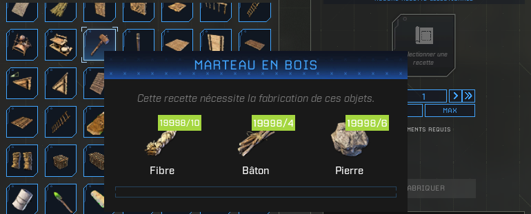

<h1 align="center">ZeusMod</h1>

<p align="center">
  <strong>Internal trainer, native injector, Electron desktop companion and
  reflection-driven debug client for Icarus.</strong><br/>
  <em>Patch-resilient · Reflection-driven · x64dbg-tier inspector · Windows x64</em>
</p>

<p align="center">
  <a href="#features">Features</a> ·
  <a href="#demo">Demo</a> ·
  <a href="#screenshots">Screenshots</a> ·
  <a href="#install">Install</a> ·
  <a href="#usage">Usage</a> ·
  <a href="docs/wiki/Home.md"><strong>📖 Wiki</strong></a> ·
  <a href="docs/INSPECT.md">Debug client</a> ·
  <a href="docs/BUILD.md">Build</a> ·
  <a href="docs/ARCHITECTURE.md">Architecture</a> ·
  <a href="CHANGELOG.md">Changelog</a>
</p>

<p align="center">
  
  
  
  
  
</p>

---

## Overview

**ZeusMod** is a research / single-player trainer for *Icarus*, built as a
Windows-only internal module. It ships as four components:

| Component                          | Role                                                                          |
|------------------------------------|-------------------------------------------------------------------------------|
| `native/internal/` → `IcarusInternal.dll` | Injected DLL — runtime hooks, UE reflection, ImGui overlay, IPC pipe   |
| `native/injector/` → `IcarusInjector.exe` | Standalone CLI injector — attaches the DLL into a running Icarus       |
| `native/shared/`   → `Shared.lib`         | IPC protocol and shared types used by both native components           |
| `app/`             → `ZeusMod.exe`        | Electron desktop launcher — install detection, **native koffi inject**, auto-update |
| `scripts/inspect.py`                      | x64dbg-style debug client (REPL + batch + watch + JSON)                |

The trainer favours **Unreal reflection** over hardcoded byte signatures: all
`UFunction` entry points and `UPROPERTY` offsets are resolved at runtime by
name via `UObjectLookup`. Most non-engine Icarus updates do not require a
rebuild. See [`docs/ARCHITECTURE.md`](docs/ARCHITECTURE.md).

---

## Features

### In-game features

| Feature              | Description                                                            |
|----------------------|------------------------------------------------------------------------|
| God Mode             | Health stays full and write-back to `SetHealth` is patched out         |
| Infinite Stamina     | Stamina stays at max while sprinting / climbing                        |
| Infinite Armor       | Armor durability is held at max                                        |
| Infinite Oxygen      | Oxygen stays at max underwater and at altitude                         |
| Infinite Food        | Hunger stays satisfied                                                 |
| Infinite Water       | Thirst stays satisfied                                                 |
| Stable Temperature   | Body temperature held at a configurable safe value                     |
| Speed Hack           | Configurable movement multiplier (walk / run / crouch / swim / fly)    |
| **No Weight (1.5)**  | `AddModifierState` detoured — Overburdened is **never applied**        |
| Free Craft           | Crafts any recipe — even **0 / N** — without consuming materials       |
| Infinite Items       | Pins consumables and clamps tools/armor to learned max durability      |
| Mega XP              | Pumps `TotalExperience` so the character visibly levels up             |
| Max Talent / Tech / Solo | Unlocks every node in each progression tree                        |
| Time Lock            | Locks time of day to a configurable hour                               |
| Give Items           | Spawns any `D_ItemTemplate` row into the player's bag                  |
| In-game ImGui Menu   | Bind: <kbd>N</kbd> to toggle menu, <kbd>F10</kbd> to unload the module |

### Desktop app features

- **Native in-process injector** (`koffi` FFI) — no PowerShell, no child
  process, end-to-end inject in 50–150 ms.
- Auto-detects your Icarus install through the Steam library folders.
- Detects whether `Icarus-Win64-Shipping.exe` is currently running.
- Live cheat toggles forwarded to the trainer over a named pipe
  (`\\.\pipe\ZeusModPipe`).
- GitHub Releases auto-update with release-note display, progress bar and
  silent installer hand-off (`electron-updater`).
- Self-contained: ships with the latest `IcarusInternal.dll` and
  `IcarusInjector.exe` inside the installer.
- Polished sidebar UI with cyan/purple gradient theme and animated status
  dot.

### Debug client (`scripts/inspect.py`) — *new in 1.5.0*

A command-line memory explorer + reflection inspector for the live game,
talking to `IcarusInternal.dll` over the debug pipe.

- Walk Unreal reflection (`UClass`, `UScriptStruct`, `UFunction`,
  `UPROPERTY`) on the live process — no SDK dump, no rebuild.
- Typed reads (`f32`/`f64`/`i32`/`i64`/ASCII/UTF-16/`FGuid`/pointer arrays).
- **x64dbg-tier scanner**: `modules`, `memmap`, `strings`, `refs`, `search`.
- Persistent **labels** + **bookmarks** (overlaid on hex-dump output).
- **Snapshots** + byte-level `diff`.
- **Struct viewer** that decodes raw memory through reflected UPROPERTY
  offsets.
- Optional **disassembly** via `capstone`.
- REPL with `readline` history + tab completion. Batch / watch / JSON modes.

Full command catalog: [`docs/INSPECT.md`](docs/INSPECT.md).

---

## Demo

<p align="center">
  <a href="https://youtu.be/Bi5PJuLMuwU">
    
  </a>
  <br/>
  <em>1.5.1 in action — DX12 overlay, freecraft + placement, multiplayer mirror, animated cards.<br/>
  ▶ <a href="https://youtu.be/Bi5PJuLMuwU">Watch on YouTube</a></em>
</p>

## Screenshots

<p align="center">
  <br/>
  <em>Desktop launcher (Electron) — install detection, native inject, auto-update</em>
</p>

<p align="center">
  <br/>
  <em>Runtime console + ImGui overlay attached to the game</em>
</p>

<p align="center">
  <br/>
  <em>Free Craft accepting a recipe with zero materials in inventory</em>
</p>

---

## Install

### Recommended (end users)

1. Grab the latest `ZeusMod-Setup-1.5.1.exe` from the
   [Releases](https://github.com/CyberSnakeH/ZeusMod/releases) page.
2. Run the installer (silent one-click NSIS — no UAC, no wizard).
3. Launch **ZeusMod** from the desktop shortcut or the Start Menu.
4. Start *Icarus*, load into a prospect, then click **Attach** in ZeusMod.

The installer ships the trainer DLL and the native injector — no separate
downloads required. Existing 1.5.0 installs will pick up 1.5.1 fully
automatically through the in-app updater.

### Developers (build from source)

See [`docs/BUILD.md`](docs/BUILD.md) for the native solution + Electron app
build steps. The third-party fetch step (ImGui, MinHook) is documented
there as well.

---

## Usage

### Desktop UI

1. Launch *Icarus* and load into a prospect.
2. Open ZeusMod — the status strip turns green ("ready to attach") once
   the game is detected.
3. Click **ATTACH TO ICARUS** — the koffi injector fires
   `LoadLibraryW` in the target process. End-to-end ≈ 50–150 ms.
4. Toggle features either:
   - from the **desktop UI** (live IPC over the pipe), or
   - from the **in-game ImGui overlay** (<kbd>N</kbd> to open).
5. Press <kbd>F10</kbd> in-game to **unload** the module cleanly.

### Debug client

```bash
# REPL
python scripts/inspect.py

# Single command
python scripts/inspect.py -c "character"

# Watch mode (1 s tick, color-diffs the output)
python scripts/inspect.py --watch "playerinv"

# Find every pointer to the player pawn in a 4 KiB window
python scripts/inspect.py -c "character = char; refs \$char \$char 0x1000"
```

Full reference: [`docs/INSPECT.md`](docs/INSPECT.md).

> ZeusMod is intended for **single-player / private play** and reverse
> engineering research only. Do not use it on official multiplayer servers.

---

## Repository layout

```text
ZeusMod/
├── .github/
│   ├── ISSUE_TEMPLATE/         Bug + feature templates
│   ├── PULL_REQUEST_TEMPLATE.md
│   └── workflows/release.yml   CI: tag push → GitHub Release
├── app/                        Electron desktop launcher + auto-updater
│   ├── src/main/               main.js, preload.js, injector.js (koffi)
│   ├── src/renderer/           index.html + js/ + styles/ (sidebar UI)
│   ├── src/assets/             icon.ico
│   └── bin/                    Bundled IcarusInternal.dll + IcarusInjector.exe
├── docs/
│   ├── ARCHITECTURE.md         How the four components fit together
│   ├── BUILD.md                Native + Electron build steps
│   ├── DEV_KIT.md              Pipe protocol, wire format, hook layout
│   ├── INSPECT.md              inspect.py command reference
│   └── assets/                 Screenshots
├── native/
│   ├── shared/                 Static lib (IPC protocol + shared types)
│   ├── injector/               IcarusInjector.exe
│   ├── internal/               IcarusInternal.dll (UE reflection + hooks)
│   └── third_party/            ImGui + MinHook (fetched by CI, gitignored)
├── scripts/
│   ├── inspect.py              x64dbg-style debug client
│   └── requirements.txt        Optional: rich + pyreadline3
├── CHANGELOG.md
├── CONTRIBUTING.md
├── LICENSE
├── README.md
└── ZeusMod.sln
```

---

## Patch resilience

ZeusMod is designed to survive most Icarus content updates without a
rebuild:

- **UFunction lookup by name** — `CanQueueItem`, `HasSufficientResource`,
  `Process`, `AddProcessingRecipe`, `AddModifierState`, `ConsumeItem`,
  `GetItemCount`, `FindItemCountByType`, `SetHealth`, … all resolved by
  their UE reflection name. The thunks are walked to their C++ impls at
  runtime via `UObjectLookup::FindNativeFunction`.
- **UPROPERTY offsets by name** — `Health`, `MaxHealth`, `Stamina`,
  `Oxygen`, `Food`, `Water`, `MaxWalkSpeed`, `TimeOfDay`,
  `InventoryComponent`, … all resolved through the `FField` chain.
- **UClass pointers** cached at runtime by class name.
- **DeployableTickSubsystem** instance located through a runtime
  `GObjects` scan.
- Patch addresses are validated to lie inside the module code range
  before any byte write.

A few low-level UE 4.27 layout assumptions remain (e.g. `FUObjectItem`
serial-number offset, `UStruct.Children` offset, the unreflected `+0x60`
active-processor `TArray` inside `DeployableTickSubsystem`). These are
stable on every patch within UE 4.27 but would need re-validation if
Icarus moved to UE5.

See [CHANGELOG.md](CHANGELOG.md) for the full per-version notes.

---

## Author

Made by **[CyberSnake](https://github.com/CyberSnakeH)**.

## License

MIT — see [LICENSE](LICENSE).

## Disclaimer

This project is provided **strictly for educational and reverse-engineering
research purposes**. It is not affiliated with, endorsed by, or sponsored
by RocketWerkz or Dean Hall. Use it only in single-player or private
sessions you control. You are solely responsible for how you use it.
