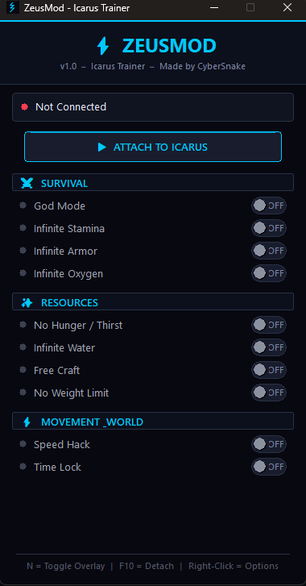

<h1 align="center">ZeusMod</h1>

<p align="center">
  <strong>Internal trainer, native injector and Electron desktop companion for Icarus.</strong><br/>
  <em>Patch-resilient · Reflection-driven · Windows x64</em>
</p>

<p align="center">
  <a href="#features">Features</a> •
  <a href="#screenshots">Screenshots</a> •
  <a href="#install">Install</a> •
  <a href="#usage">Usage</a> •
  <a href="#build-from-source">Build</a> •
  <a href="#architecture">Architecture</a> •
  <a href="CHANGELOG.md">Changelog</a>
</p>

<p align="center">
  
  
  
  
</p>

---

## Overview

**ZeusMod** is a research / single-player trainer for *Icarus*, built as a
Windows-only internal module. It is structured around three native pieces and
one desktop companion app:

| Component         | Role                                                                          |
|-------------------|-------------------------------------------------------------------------------|
| `IcarusInternal`  | Injected DLL — runtime hooks, UE reflection lookup, ImGui overlay, IPC pipe   |
| `IcarusInjector`  | Standalone native injector — attaches the DLL into a running Icarus process   |
| `app/`            | Electron desktop launcher — install detection, one-click inject, auto-update  |
| `Shared/`         | Shared headers, enums and constants used by the native components             |

The trainer favours **Unreal reflection** over hardcoded byte signatures: all
`UFunction` entry points and `UPROPERTY` offsets are resolved at runtime by
name via `UObjectLookup`. Most non-engine Icarus updates do not require a
rebuild.

---

## Features

### In-game features

| Feature              | Description                                                            |
|----------------------|------------------------------------------------------------------------|
| God Mode             | Health stays full and write-back to `SetHealth` is patched out         |
| Infinite Stamina     | Stamina stays at max while sprinting / climbing                        |
| Infinite Armor       | Armor durability is held at max                                        |
| Infinite Oxygen      | Oxygen stays at max underwater and at altitude                         |
| Infinite Food        | Hunger stays satisfied                                                 |
| Infinite Water       | Thirst stays satisfied                                                 |
| Speed Hack           | Configurable movement multiplier (walk / run / crouch / swim / fly)    |
| No Weight Limit      | `GetTotalWeight` patched to return `0`                                 |
| Free Craft           | Crafts any recipe — even **0 / N** — without consuming materials       |
| Time Lock            | Locks time of day to a configurable hour                               |
| In-game ImGui Menu   | Bind: <kbd>N</kbd> to toggle menu, <kbd>F10</kbd> to unload the module |

> Free Craft now works on recipes the player has **zero** ingredients for.
> The `CanQueueItem`, `HasSufficientResource`, `GetResourceRecipeValidity`
> and `CanSatisfyRecipeQueryInput` validation chain is fully bypassed,
> the `DeployableTickSubsystem` active-processor list is auto-populated,
> and outputs land in the correct deployable inventory.

### Desktop app features

- Auto-detects your Icarus install through the Steam library folders
- Detects whether `Icarus-Win64-Shipping.exe` is currently running
- One-click DLL injection from the desktop UI
- Live cheat toggles forwarded to the trainer over a named pipe
  (`\\.\pipe\ZeusModPipe`)
- GitHub Releases auto-update with release-note display, progress bar and
  installer hand-off
- Self-contained: ships with the latest `IcarusInternal.dll`,
  `IcarusInjector.exe` and `inject.ps1` inside the installer

---

## Screenshots

<p align="center">
  <br/>
  <em>Desktop launcher (Electron) — install detection, inject, auto-update</em>
</p>

<p align="center">
  <br/>
  <em>Runtime console + ImGui overlay attached to the game</em>
</p>

<p align="center">
  <br/>
  <em>Free Craft accepting a recipe with zero materials in inventory</em>
</p>

---

## Install

### Recommended (end users)

1. Grab the latest `ZeusMod-Setup-1.3.0.exe` from the
   [Releases](https://github.com/CyberSnakeH/ZeusMod/releases) page.
2. Run the installer (UAC elevation required).
3. Launch **ZeusMod** from the desktop shortcut or the Start Menu.
4. Start *Icarus*, load into a prospect, then click **Inject** in ZeusMod.

The installer ships the trainer DLL, the native injector and the PowerShell
remote-thread injector script — no separate downloads required.

---

## Usage

1. Launch *Icarus* and load into a prospect.
2. Open ZeusMod and wait for *Game running* to turn green.
3. Click **Inject** — the trainer attaches to the live process.
4. Toggle features either:
   - from the **desktop UI** (live IPC over the pipe), or
   - from the **in-game ImGui overlay** (<kbd>N</kbd> to open).
5. Press <kbd>F10</kbd> in-game to **unload** the module cleanly.

> ZeusMod is intended for **single-player / private play** and reverse
> engineering research only. Do not use it on official multiplayer servers.

---

## Build from source

### Requirements

- Windows 10 / 11 (x64)
- Visual Studio 2022 with the **Desktop development with C++** workload
- Windows 10 SDK (any recent revision)
- Node.js 20+ (for the Electron app)

### Native solution

```powershell
git clone https://github.com/CyberSnakeH/ZeusMod.git
cd ZeusMod
start IcarusMod.sln
```

Active projects: `Shared`, `IcarusInjector`, `IcarusInternal`.
Build configuration:

```text
Release | x64
```

Outputs land in `bin/Release/`:

- `IcarusInternal.dll` — the injected trainer
- `IcarusInjector.exe` — the standalone external injector

### Electron app

```powershell
cd app
npm install
npm run dist
```

The packaged installer (`ZeusMod-Setup-1.3.0.exe`) is written to
`app/dist/`. The build expects the latest `IcarusInternal.dll` and
`IcarusInjector.exe` inside `app/bin/`, and `inject.ps1` inside
`app/scripts/`.

To refresh those after a native rebuild:

```powershell
copy bin\Release\IcarusInternal.dll  app\bin\IcarusInternal.dll
copy bin\Release\IcarusInjector.exe  app\bin\IcarusInjector.exe
```

---

## Architecture

```text
ZeusMod/
├── IcarusInjector/      # Native external injector (CreateRemoteThread + LoadLibrary)
├── IcarusInternal/      # Injected DLL: hooks, overlay, UObjectLookup, IPC pipe
├── Shared/              # Shared headers, enums, project types
├── app/                 # Electron desktop launcher + auto-updater
│   ├── main.js
│   ├── preload.js
│   ├── src/             # Renderer (HTML / CSS / JS)
│   ├── bin/             # Bundled IcarusInternal.dll + IcarusInjector.exe
│   └── scripts/         # inject.ps1 (PowerShell remote-thread injector)
├── Pictures/            # README screenshots
├── release/             # CI staging folder
└── NotUsed/             # Archived tools, retired trainer, old SDK dumps
```

### Native runtime flow

1. `IcarusInjector` (or the Electron app) launches and injects
   `IcarusInternal.dll` into `Icarus-Win64-Shipping.exe`.
2. `IcarusInternal` initializes `UObjectLookup`, which AOB-scans for
   `GUObjectArray` and `FNamePool`.
3. All UFunction entry points and UPROPERTY offsets used by the trainer are
   resolved by **name**, walking thunks to their C++ implementations via
   HDE64 disassembly.
4. MinHook installs detours on the resolved entry points.
5. The DLL exposes a named pipe (`\\.\pipe\ZeusModPipe`) for the desktop
   app to push live cheat toggles.
6. The in-game ImGui overlay reads/writes trainer state directly.

### Desktop app flow

1. The launcher discovers your Steam install and resolves the Icarus
   install directory through the AppManifest.
2. It polls for the `Icarus-Win64-Shipping.exe` process state.
3. On **Inject**, it spawns `inject.ps1` to perform a remote-thread
   `LoadLibraryW` against the running game.
4. Cheat toggles in the UI are sent over the named pipe.
5. The updater queries the latest GitHub Release, compares versions, shows
   release notes, downloads the installer with progress, and hands off.

---

## Patch resilience

ZeusMod is designed to survive most Icarus content updates without a
rebuild:

- **UFunction lookup by name** — `CanQueueItem`, `HasSufficientResource`,
  `Process`, `AddProcessingRecipe`, `ConsumeItem`, `GetItemCount`,
  `FindItemCountByType`, `SetHealth`, … all resolved by their UE
  reflection name. The thunks are walked to their C++ impls at runtime.
- **UPROPERTY offsets by name** — `Health`, `MaxHealth`, `Stamina`,
  `Oxygen`, `Food`, `Water`, `MaxWalkSpeed`, `TimeOfDay`,
  `InventoryComponent`, … all resolved through the `FField` chain.
- **UClass pointers** cached at runtime by class name.
- **DeployableTickSubsystem** instance located through a runtime
  `GObjects` scan.
- Patch addresses are validated to lie inside the module code range
  before any byte write.

A few low-level UE 4.27 layout assumptions remain (e.g. `FUObjectItem`
serial-number offset, `UStruct.Children` offset, the unreflected
`+0x60` active-processor `TArray` inside `DeployableTickSubsystem`).
These are stable on every patch within UE 4.27 but would need
re-validation if Icarus moved to UE5.

See [CHANGELOG.md](CHANGELOG.md) for the full per-version notes.

---

## Repository hygiene

Legacy material that is no longer part of the active build lives under
[`NotUsed/`](NotUsed):

- archived SDK dumps
- retired tools (memory dumpers, AOB scanner, UE4SS injector)
- the legacy trainer project
- third-party source drops kept for reference

The active tree only contains the maintained injector, internal runtime,
and desktop launcher.

---

## License

MIT — see [LICENSE](LICENSE) if present, otherwise the package metadata.

## Disclaimer

This project is provided **strictly for educational and reverse-engineering
research purposes**. It is not affiliated with, endorsed by, or sponsored
by RocketWerkz. Use it only in single-player or private sessions you
control. You are solely responsible for how you use it.
